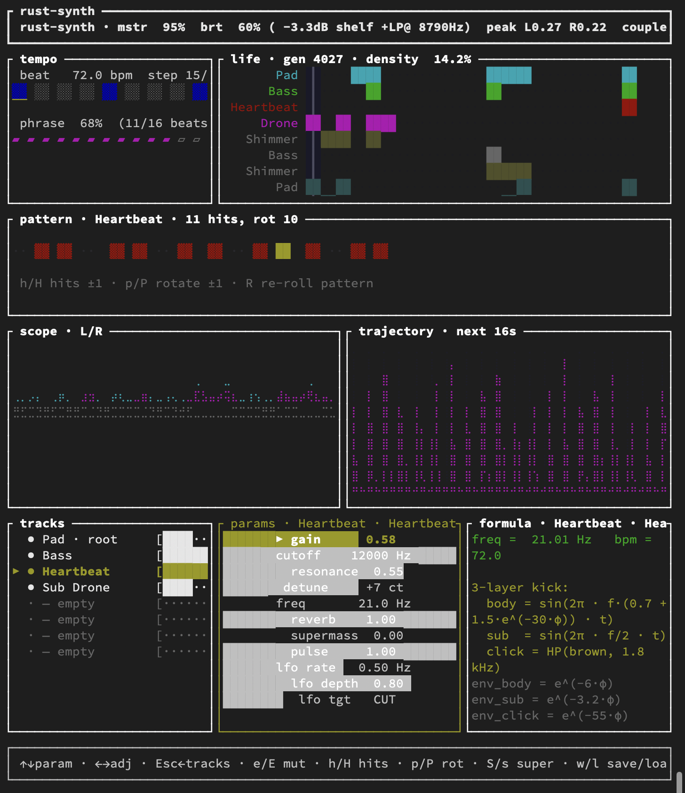

# rust-synth

Terminal modular ambient synthesizer. Long cinematic Zimmer-style pads,
drones, kick patterns and evolving textures — driven by math formulas
(sigmoid, perlin, euclidean, golden ratio, game of life) inside FunDSP
closures. No GUI, no DAW. Ratatui TUI on top of cpal audio output.

```
cargo run --release
```


<!-- drop a screenshot here once you have one -->

## What it does

- **8 pre-allocated voices**, 4 active by default: Pad, Bass, Heartbeat
  (kick), Sub Drone. Activate more with `a` — picks a golden-ratio
  frequency relative to existing tracks.
- **5 preset kinds**: `Pad` · `Drone` · `Shimmer` · `Heartbeat` (3-layer
  kick drum) · `Bass` (sustained groove).
- **16-step Euclidean drum sequencer** per track. `hits` + `rotation`
  sliders produce musically coherent patterns — any random combination
  is already a valid groove.
- **Per-track LFO** routable to cutoff, gain, freq (vibrato) or reverb.
- **Valhalla-Supermassive-inspired reverb send** per track. Two cascaded
  FDN reverbs with chorus between — 28-second tail with stereo modulation.
- **Game of Life grid coupled to audio both ways.** Each track's row
  gets seeded with alive cells per beat; row density continuously
  modulates that track's gain. Every 8 beats the row with the lowest
  density triggers genetic mutation of the weakest track.
- **Genetic evolution**: freq snaps to golden pentatonic, cutoff drift,
  pattern hits/rotation mutate too. Keys `e` / `E` / `x` for manual
  mutate / mutate-all / crossover.
- **Master bus**: high-shelf @ 3.5 kHz + lowpass + limiter, all driven
  by one `brightness` slider.
- **Preset save/load** (TOML, human-readable).
- **Master recording** to FLAC 24-bit in a background thread.
- **Live formula pane** — see the math of the current preset with your
  live param values substituted.
- **Trajectory forecast** — plots the next 16 seconds of amplitude /
  cutoff / pulse curves based on current settings.
- **Pixel-art Life grid**, **scope oscilloscope**, **16-step pattern
  grid with play-head cursor**.

## Controls

### Global
| key | action |
|-----|--------|
| `q` / `Esc` | quit |
| `[` / `]` | master gain ∓ 5 % |
| `{` / `}` | brightness ∓ 5 % (master EQ + LP) |
| `,` / `.` | BPM ∓ 1 |
| `<` / `>` | BPM ∓ 5 |
| `L` | toggle Life ↔ Audio coupling |
| `O` | toggle auto-evolve |
| `R` | re-seed Life with fresh gliders |
| `e` / `E` | mutate selected / all active tracks |
| `x` | crossover selected with next track |
| `S` / `s` | supermass reverb on / off for selected |
| `w` | save preset → `presets/*.toml` |
| `l` | load latest preset |
| `c` | start / stop recording → `recordings/*.flac` |
| `h` / `H` | euclidean hits ∓ 1 |
| `p` / `P` | euclidean rotation ∓ 1 |

### Tracks pane (left)
| key | action |
|-----|--------|
| `↑` / `↓` | select track |
| `Enter` / `→` / `Tab` | switch to Params pane |
| `a` | activate next dormant slot |
| `d` | kill (mute) selected |
| `m` | toggle mute |
| `r` | re-roll all params of selected track |

### Params pane (right)
| key | action |
|-----|--------|
| `↑` / `↓` | select parameter |
| `←` / `→` | adjust value |
| `Esc` / `Tab` | back to Tracks |

11 params per track: `gain`, `cutoff`, `resonance`, `detune`, `freq`,
`reverb`, `supermass`, `pulse`, `lfo rate`, `lfo depth`, `lfo tgt`
(OFF · CUT · GAIN · FREQ · REV).

## Presets — the math

### PadZimmer
```
osc(t) = Σ Aₖ · sin(2π · f · rₖ · t)          rₖ = [1, 1.501, 2.013, 3.007]
cut(t) = cutoff · (1 + 0.10 · phrase_wobble)  (+ optional LFO ±1 oct)
y = Moog(osc, cut, q) ⇒ HPshelf(3k, −3.5 dB)
       ⇒ chorus_L | chorus_R ⇒ hall(18m, 4s) ⇒ supermass_send
```

### BassPulse
```
osc = 0.55·sin(2πft) + 0.22·sin(4πft) + 0.35·sin(πft)
y = Moog(osc, min(cut, 900Hz), min(q, 0.65))
  · groove(t)           groove = 0.45 + 0.55·e^(−3.5·φ)
  ⇒ hall(14m, 2.5s) ⇒ supermass_send
```

### Heartbeat (3-layer kick, step-gated)
```
body   = sin(2π · f·(0.7 + 1.5·e^(−40·φₛ)) · t)  · e^(−4·φₛ)   on active step
sub    = sin(π · f · t)                            · e^(−1.5·φₛ) on active step
click  = HP(brown, 1.8 kHz)                       · e^(−40·φₛ) on active step

where active = (euclidean_bits(hits, rotation) >> step) & 1
      step   = (t · bpm/60 · 4) mod 16           (16th-note resolution)
      φₛ     = fract(t · bpm/60 · 4)             (phase within the step)
```

### DroneSub
```
sub(t) = 0.45·sin(π·f·t) + 0.12·sin(2π·f·t)
noise  = Moog(brown(t), clip(cut, 40..300), q)
am(t)  = 0.88 + 0.12·½(1 − cos(2π·bpm/60·t))
y = (sub + 0.28·noise) · am ⇒ hall(20m, 5s) ⇒ supermass_send
```

### Shimmer
```
y = HP(0.18·sin(4πft) + 0.12·sin(6πft) + 0.08·sin(8πft), 400 Hz)
  ⇒ hall(22m, 6s) ⇒ supermass_send
```

### Master bus
```
stereo_sum
  ⇒ highshelf(3.5 kHz, q=0.7, gain = 0.2..1.0)      ← driven by brightness
  ⇒ lowpass(cutoff = 3k..18k, q=0.5)                 ← driven by brightness
  ⇒ limiter_stereo(1 ms attack, 300 ms release)
  ⇒ cpal
```

## Architecture

```
src/math/
  sigmoid.rs   smoothstep, sigmoid, softexp, ease
  pulse.rs     beat_phase, pulse_decay, phrase_phase (f64 for multi-hour stability)
  harmony.rs   PHI, golden_freq, golden_pentatonic, xorshift RNG
  rhythm.rs    16-step Euclidean bitmask (Bjorklund-style)
  life.rs      Conway's Game of Life (toroidal B3/S23)
  genetic.rs   Genome + mutate / crossover (snaps freq to golden pentatonic)
  rnd.rs       Perlin 1D, brown walk, value noise
src/audio/
  track.rs     TrackParams (Shared atomics) — lock-free audio/UI shared state
  preset.rs    5 preset graphs + LfoBundle + master_bus + supermass_send
  engine.rs    cpal setup, 8-track master graph, scope ring buffer
src/tui/
  app.rs       ratatui event loop + key bindings + Focus mode
  tracks.rs    left pane list
  params.rs    right pane 11 sliders
  formula.rs   live math with substituted values
  beats.rs     BPM beat grid + phrase progress
  pattern.rs   16-step Euclidean grid with play-head
  life.rs      chunky pixel-art grid (one row per track)
  waveform.rs  stereo oscilloscope (braille canvas)
  trajectory.rs  next-16-seconds envelope forecast
src/recording.rs   FLAC 24-bit via flacenc (background encode thread)
src/persistence.rs TOML preset save/load with serde defaults
cli/main.rs        offline WAV render mirroring default tracks
```

All long-running DSP state is `f64` (FunDSP `hacker` module) so time
counters stay precise for 100+ hours — `hacker32` drifts around 5 min
at 48 kHz.

## Key invariants

- **Audio callback never locks anything except a tiny scope
  ring-buffer mutex.** All live params flow through FunDSP `Shared`
  atomics. Patterns use `Arc<AtomicU32>` loads (Relaxed).
- **Resonance is capped at 0.65 in the audio path.** Higher values
  would turn the Moog ladder into a self-oscillating sine wave at
  cutoff frequency — classic "whistle" bug.
- **Supermass reverbs have damping ≥ 0.88.** 28-second T60 with lower
  damping piles up 4–8 kHz resonances.
- **Euclidean distribution guarantees musical patterns.** Any random
  `(hits, rotation)` is already a valid groove — no cluster, no gap.

## Building

Needs Rust 1.75+ and a working audio device.

```sh
make run          # release build + TUI
make dev          # debug build + TUI
make render       # 30 s offline WAV → out/render.wav
make integration  # 5 s smoke test
make check        # fmt + clippy -D warnings + test
```

Tests:
```sh
cargo test
```

19 tests cover the math layer end-to-end (Bjorklund, blinker
oscillator, golden determinism, sigmoid/smoothstep range, FLAC encode
roundtrip).

## License

MIT. Made by [@fortunto2](https://github.com/fortunto2) with help from
Claude Code.
